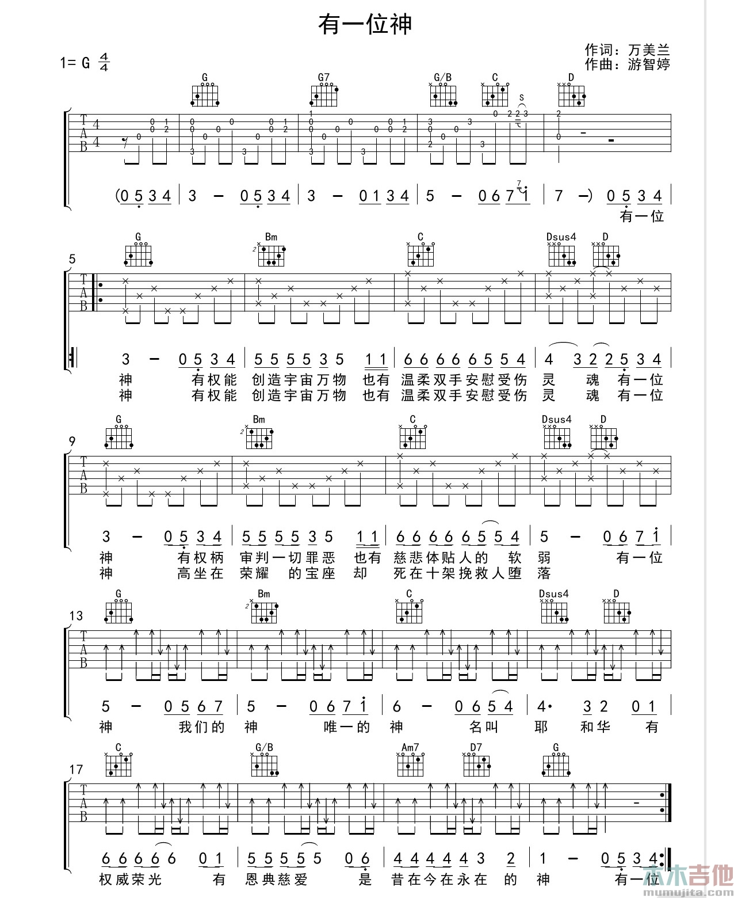
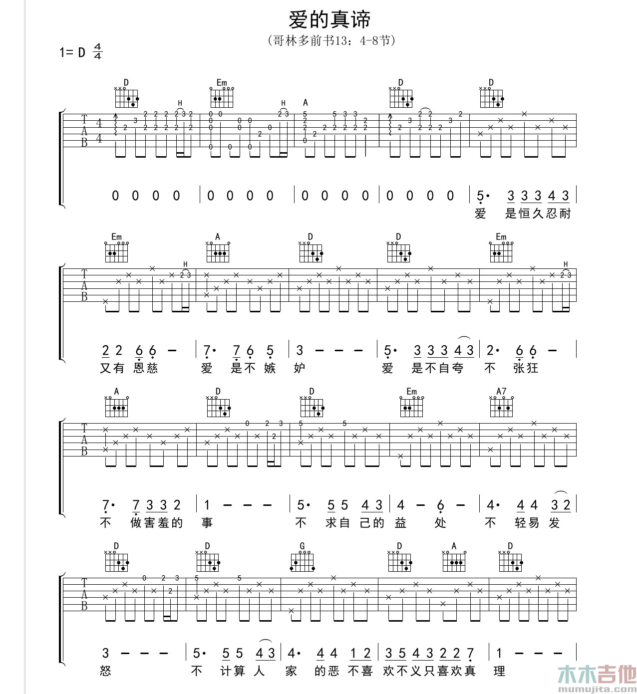
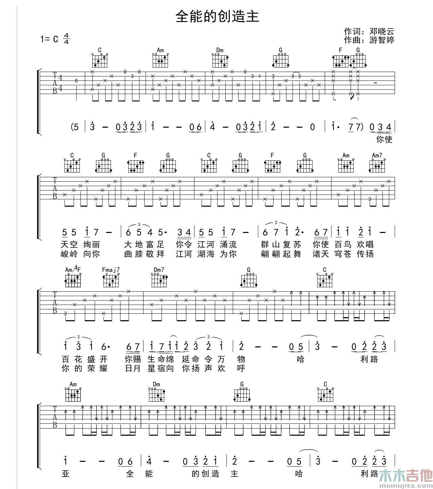
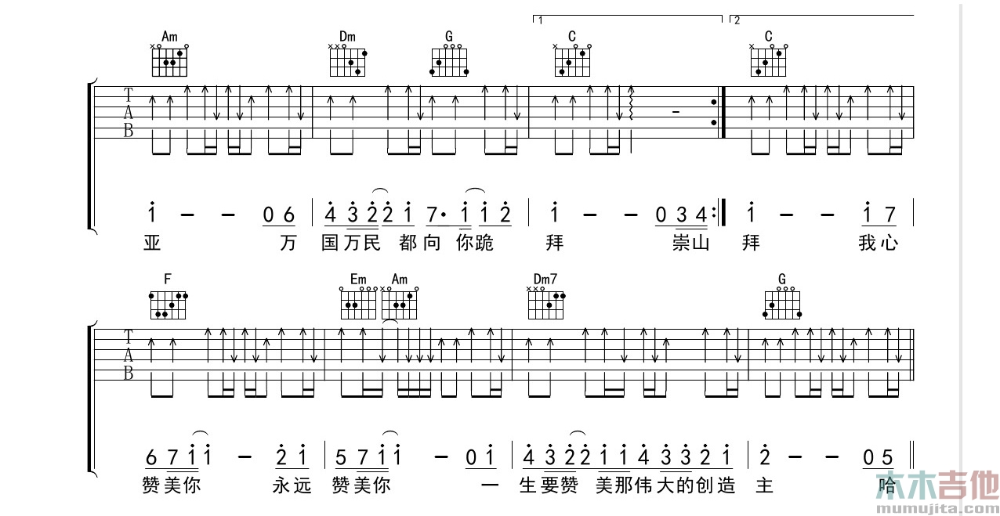
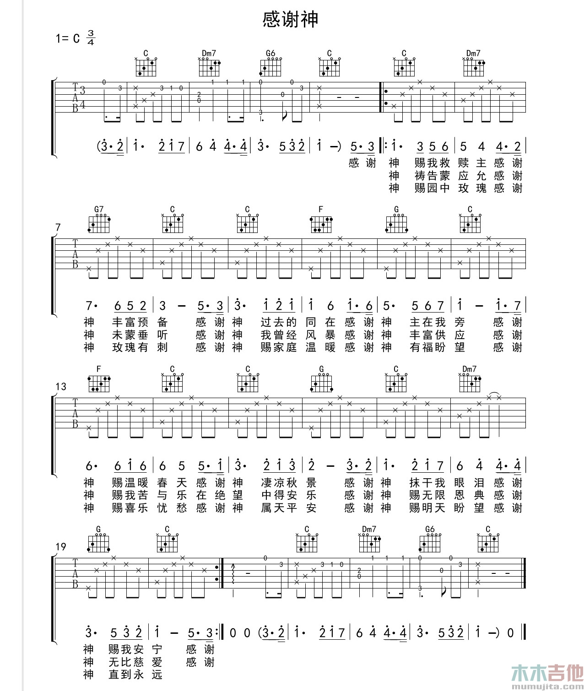
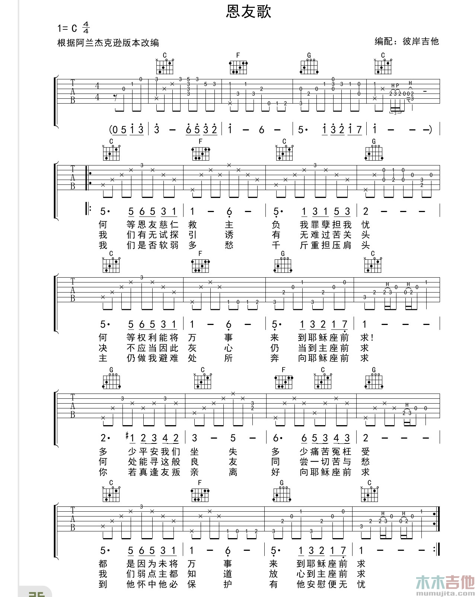
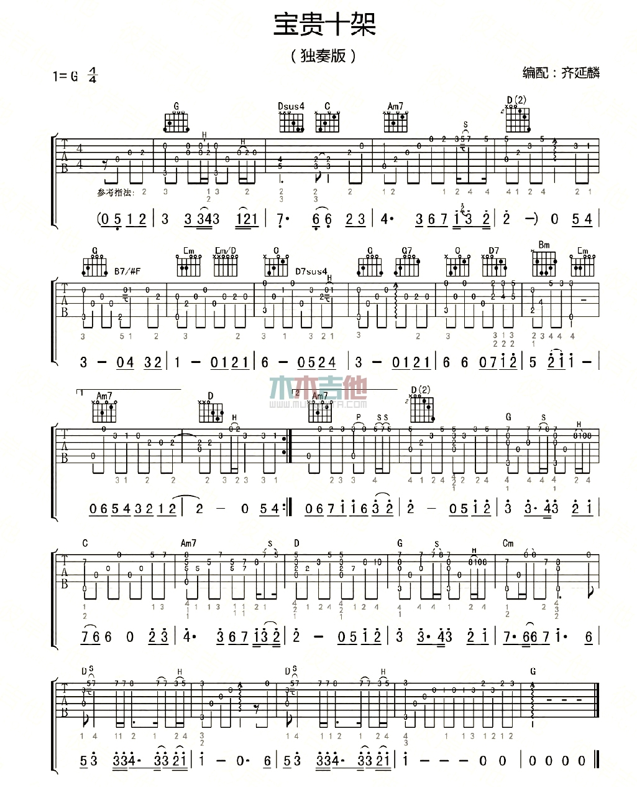
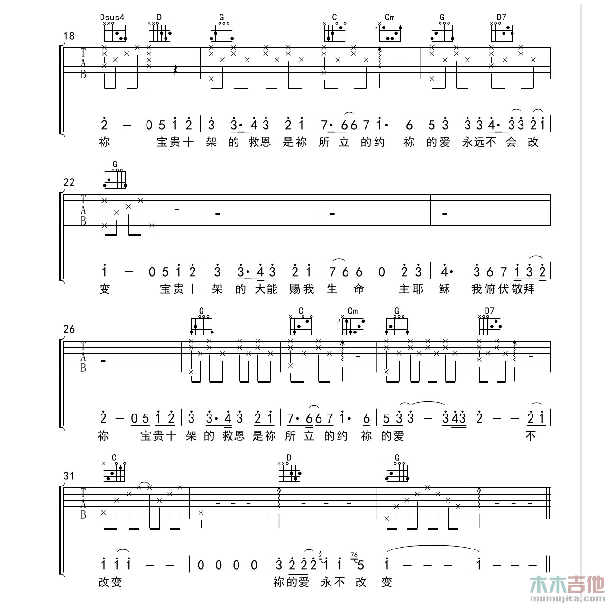
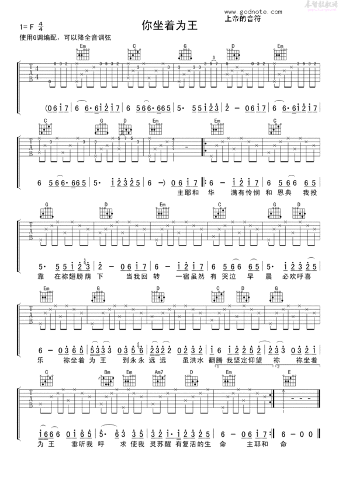

title: 诗歌吉他和弦 
date: 2016-02-20 16:52:44
tags:
- 吉他
- 和弦

categories:
- 音乐

---

- 那双看不见的手 
  - 15634145

<!--more-->

- 有一位神
  - 

- 爱的真谛
  - 

- 全能的创造主
  - 
  - 

- 感谢神
  - 
  - 

- 恩友歌
  - 

- 宝贵十架
  - 
  - 
  - 

- 你坐着为王
  - 

- 每一天所度过的每一刻
  - 

- 何等恩典
  - 1.41.41.25.1.41.25.1.1.41.2.5.1.4.15.1.1.4.2.45.1.4.15.1
  - 

- 你流出宝血
C           G           Am          Em
你流出宝血　洗淨我污秽　将我的生命赎回
F             Em      Am  F           G
你为了我的罪　牺牲永不悔　显明你极大恩惠
C           G           Am          Em
我深深体会　你爱的宝贵　献上自己永追随
F             Em        Am
或伤心或气馁　或生离或死别　
F              G        G7
愿刚强壮胆永远不后退　  哦
C           G
你爱永不变　从今直到永远　
Am        Em      F
深深浇灌我心田　或天旋或地转
Em      Am      F             G C　
经沧海历桑田　都不能叫我与你爱隔绝

- 宣教的中国 
  - 1561 245 1564 151 563 62 541 251 141 56251
  - C 4/4
    C       G/B      Am        C/G
    有一种爱象那夏虫永长呜
    Dm7      F/G  G
    春蚕吐丝吐不尽
     C    G/B     Am      F
    有一个声音催促我要勇敢前行
      C/G     G    C
    圣灵在前引导我的心
      G/B  Am       Em
    迈开步 伐向耶路撒冷
       Am         Dm
    风霜雪雨  意志更坚定
    G       F        C
    我要传扬传扬主的名
       Dm  G       C
    誓要得胜在 神的国度里
    F/G     C              F      C
    我带着使命向前走要唤醒沉睡的中国
    G/B  Am           Dm7       G
    纵然流血的时候我也永远不回头
       C             F      C
    我带着异象向前走要看到宣教的中国
    G/B  Am      Dm7  G   C
    将福音传遍世界每 个角落

- 最知心的朋友 不规律

- 如鹿渴慕溪水 1645 164.51 1642.3 164.51
